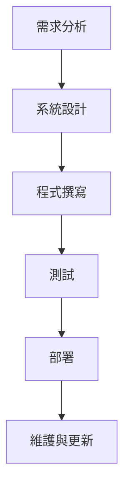

# AI創造工作坊
## 基本練習:用 Markdown 寫一篇短文
> 我對這堂課的期待
- Github 基本介面操作
- 學會配合AI 寫出**Markdown**、做出**Mermaid**圖表
---
## 進階練習:Mermaid 圖表寫一個你認為的軟體開發流程

```mermaid
flowchart TD
    A[需求分析] --> B[系統設計]
    B --> C[程式撰寫]
    C --> D[測試]
    D --> E[部署]
    E --> F[維護與更新]
```
