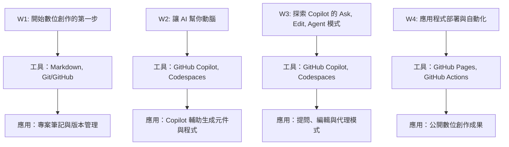

# 🤖 2025 AI創造工作坊: 文科視角的 AI 應用開發入門

## 課程簡介

## 第 1 週：開始數位創作的第一步

- 工具重點：**Markdown, Git/GitHub**
- 📚 [課程簡報](https://howard-haowen.github.io/genai_workshop/2025/w1_deck_marp.html)

## 第 2 週：讓 AI 幫你動腦

- 工具重點：**GitHub Copilot, GitHub Codespaces**
- 📚 [課程簡報](https://howard-haowen.github.io/genai_workshop/2025/w2_deck_marp.html)

## 第 3 週：探索 GitHub Copilot 的三種互動模式

- 工具重點：**GitHub Copilot, GitHub Codespaces**
- 📚 [課程簡報](https://howard-haowen.github.io/genai_workshop/2025/w3_deck_marp.html)

## 第 4 週：應用程式部署與自動化

- 工具重點：**GitHub Pages, GitHub Actions**
- 📚 [課程簡報](https://howard-haowen.github.io/genai_workshop/2025/w4_deck_marp.html)
